# Group Member
- Member 1: Nasrun Asri Bin Muhammad (2210479)
- Member 2: Sofwan Bin Aliza (2224483)
- Member 3: Muhd Iskandar Bin Yong Fui Min (2214527)
- Member 4: Muhammad Zarul Hafizzuddin Bin Mohd Zaidi (2215331)
- Member 5: Esma Dennis Bin Mohd Adam (2316821)

#  Moonlit Lagoon Hotel - Hotel Management System

# Introduction of the Web Application
  A **Hotel Management System** is a web application platform designed to simplify hotel operations and provide an enhanced experience for guests. It enables administrators and customers to efficiently manage various aspects of hotel services, such as user accounts, room allocations, bookings, payments and ratings and reviews. By incorporating CRUD (Create, Read, Update, Delete) functionalities, the system ensures effective data handling, making it a reliable and user-friendly solution for the hospitality industry.

  The system’s features cover five main areas: **User Profiles, Bookings, Payments, Reviews & Ratings and Admin Control Panel**. Customers can create and manage user profiles, search for and book their prefered rooms as well as leave reviews for their stays, while administrators can oversee room allocations, track bookings and manage guest details in bookings. These features work together to ensure both convenience for customers and operational efficiency for our hotel staff. For instance, users can view booking histories and receipts, update personal details, or cancel reservations, while admins can adjust room allocation and monitor customer bookings.
   
  Overall, the **Hotel Management System** provides a robust and integrated approach to handling hotel operations. It simplifies complex tasks like managing payments or processing customer bookings and provide more efficient and satisfying guest experience. With its intuitive design and emphasis on data accuracy, the system enhances productivity for hotel staff while offering convenience to customers. This makes it an essential tool for modernizing hotel management processes.
    
# Objectives of the Enhancements
The objectives of enhancments are: 

1. To protect the application from malicious or invalid user input by enforcing strict validation rules, ensuring data integrity, and preventing common security attacks such as injection and XSS.

2. To secure the Hotel Management System by implementing robust authentication and authorization mechanisms that verify user identity, control access to resources, and ensure users can only perform actions on their own data, preventing unauthorized access and privilege escalation. 

3. To enhance the security of the Hotel Management System by preventing Cross-Site Scripting (XSS) and Cross-Site Request Forgery (CSRF) attacks through appropriate escaping and sanitizing user-generated content, enforcing secure output rendering, and implementing CSRF protection mechanisms to ensure that all state-changing requests originate from legitimate and authenticated users.

4. To ensures that hotel booking documents and customer-related files are securely stored and accessed only by authorized users. Also we enhance the system to reduce the risk of unauthorized access, data leakage, and exploitation within the Hotel Management System.

5. To strengthen the security of the Hotel Management System by protecting the database against SQL injection attacks, unauthorized access, and data exposure, while ensuring secure, reliable, and maintainable database interactions.

# Web Application Security Enhancements

   ## Input Validation
   ### 1. Register
   ### a) Server-side Validation
   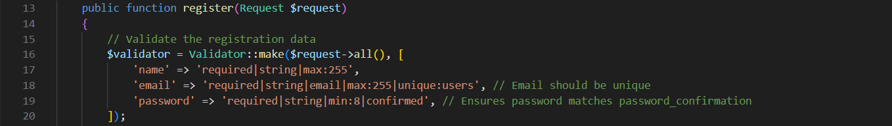
   Figure 1: Code in RegisterController.php before enhancement.

   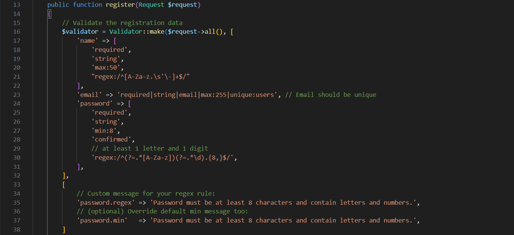
   Figure 2: Code in RegisterController.php after enhancement.
   
   #### i) Name (Whitelist + Normalization)
   - For the name input, a whitelist validation approach is applied where only alphabetic characters, spaces, apostrophes ('), hyphens (-), and dots (.) are allowed. Any other symbols or numbers are rejected. In addition, the name is normalized before being stored in the database by trimming extra spaces and converting it to Title Case, where the first letter of each word is uppercase and the remaining letters are lowercase. This ensures consistent and clean user data.
   
   #### ii) Password (Whitelist)
   - The password field uses whitelist validation rules that require a minimum length of 8 characters and enforce the presence of at least one alphabetic character and one numeric digit. This ensures stronger password complexity and reduces the risk of weak or easily guessable passwords.

   ### b) Client-side Validation
   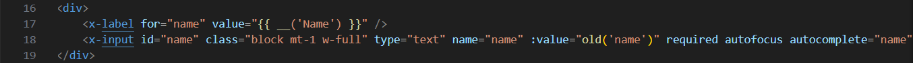
   Figure 3: Code in register.blade.php before enhancement.

   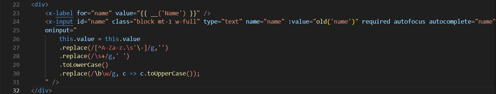
   Figure 4: Code in register.blade.php after enhancement.
   
   #### i) Name (Whitelist + Input Filtering)
   - For the name input, client-side input filtering is applied using JavaScript (oninput) to restrict the characters that can be typed. Only alphabetic characters, spaces, apostrophes ('), hyphens (-), and dots (.) are allowed, while other characters such as numbers and special symbols are automatically removed. The input is also formatted in real time by collapsing multiple spaces and converting the text to Title Case to improve consistency and user experience before submission.

   ### c) User Interface (UI)
   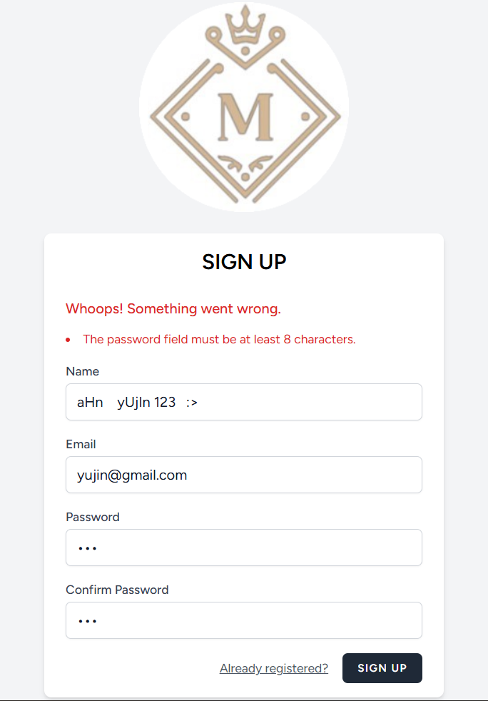
   
   Figure 5: User interface in register page before enhancement.

   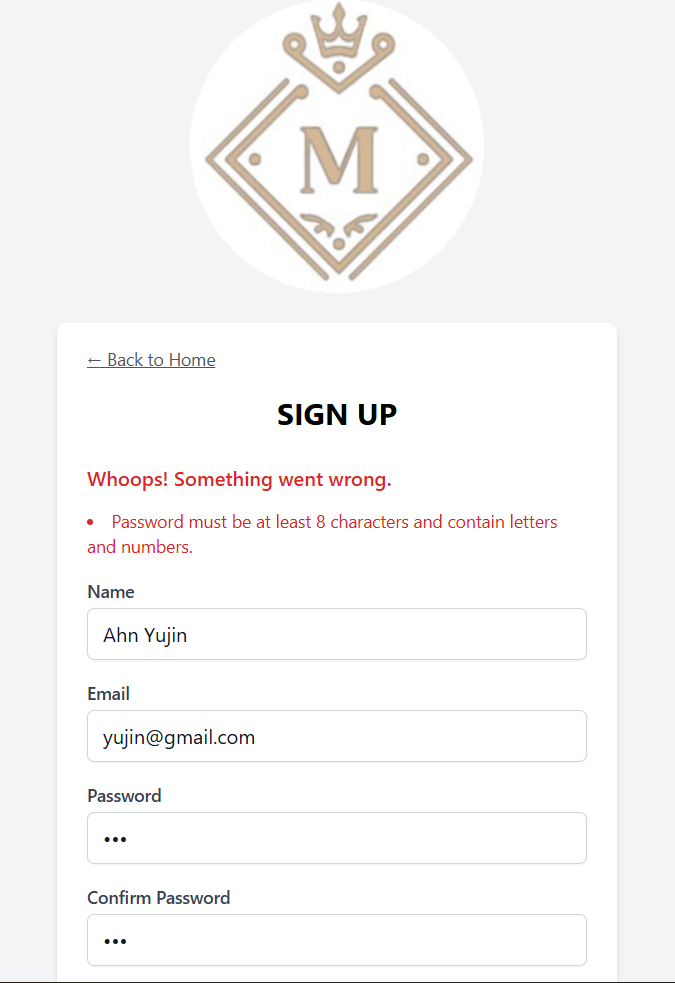
   
   Figure 6: User interface in register page after enhancement.

   ### 2. Payment
   ### a) Server-side Validation
   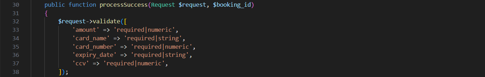
   Figure 7: Code in PaymentController.php before enhancement.

   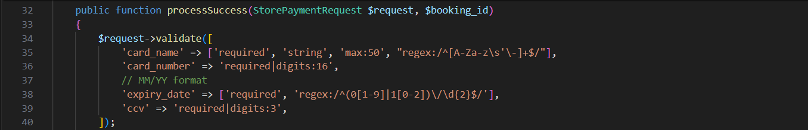
   Figure 8: Code in PaymentController.php after enhancement.
   
   #### i) Cardholder Name (Whitelist + Normalization)
   - A whitelist validation approach is applied to the cardholder name field where only alphabetic characters, spaces, apostrophes ('), and hyphens (-) are allowed. The input is also normalized on the server by converting it to uppercase before processing. This prevents invalid characters and ensures consistent formatting of cardholder names.

   #### ii) Card Number (Whitelist)
   - The card number is validated using whitelist rules that require exactly 16 digits. To support formatted input (e.g., 0000 0000 0000 0000), the server normalizes the card number by removing spaces and non-digit characters before validation. This ensures the system only processes numeric digits and prevents invalid or manipulated values.

   #### iii) Expiry Date (Whitelist)
   - The expiry date uses whitelist validation with a strict format rule (MM/YY). The month is restricted to valid values (01–12) and the input is rejected if it does not follow the expected pattern. This ensures the expiry value is valid and consistent.

   #### iv) CVV (Whitelist)
   - The CVV field is validated using whitelist rules that require exactly 3 digits. This prevents users from entering longer values or non-numeric input.

   ### b) Client-side Validation
   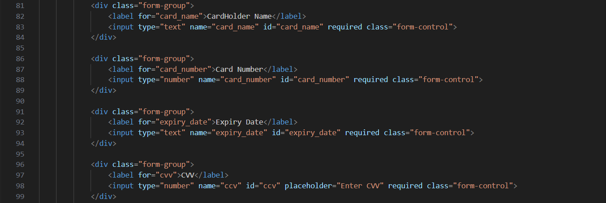
   Figure 9: Code in payment.blade.php before enhancement.

   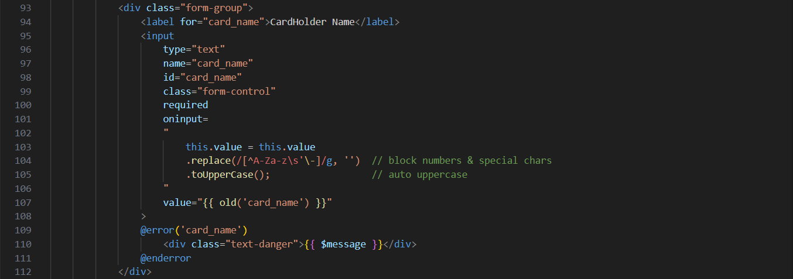
   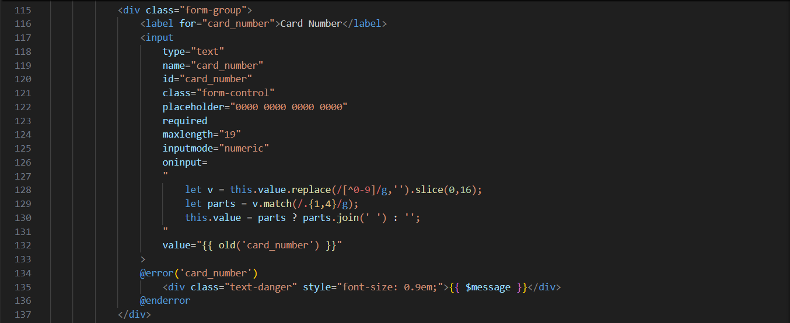
   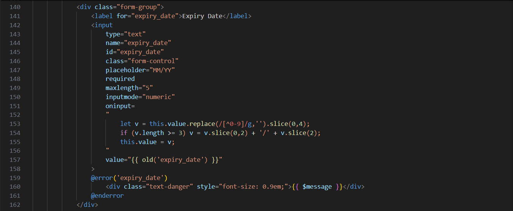
   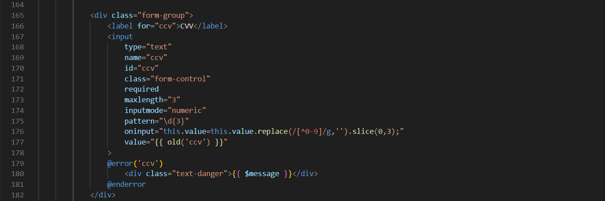
   Figure 10: Code in payment.blade.php after enhancement.
   
   #### i) Cardholder Name (Whitelist + Input Filtering)
   - Client-side filtering is applied using oninput to restrict characters typed by the user. Only allowed characters remain, and the input is automatically converted to uppercase. This improves usability and prevents accidental invalid input before submission.

   #### ii) Card Number (Whitelist + Formatting + Length Restriction)
   - Client-side input formatting is applied so the card number automatically groups digits into blocks of 4 (e.g., 0000 0000 0000 0000). The form limits the card number to a maximum of 16 digits and removes any non-numeric characters during typing/paste. This improves user experience and reduces input mistakes.

   #### iii) Expiry Date (Whitelist + Formatting + Length Restriction)
   - Client-side formatting ensures the expiry date accepts only numeric input and automatically inserts a / after the first two digits, producing the MM/YY format. This helps users input the correct format more easily.

   #### iv) CVV (Whitelist + Length Restriction)
   - Client-side restrictions such as maxlength=3, numeric-only input filtering, and pattern validation ensure the user can only enter 3 digits. Any extra digits are not accepted, reducing errors.

   ### c) User Interface (UI)
   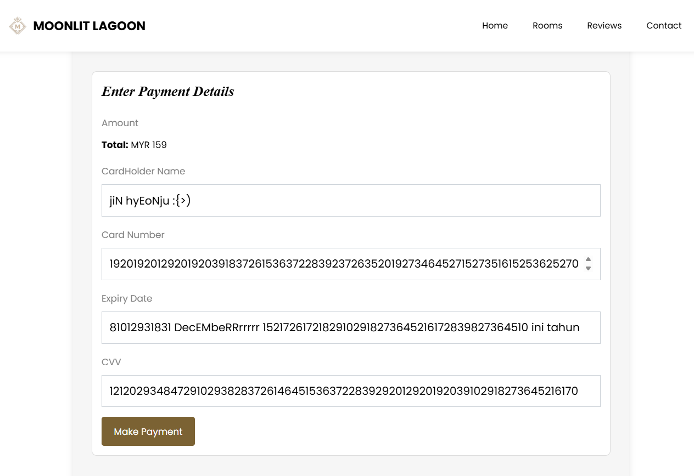
   Figure 11: User interface in payment page before enhancement.

   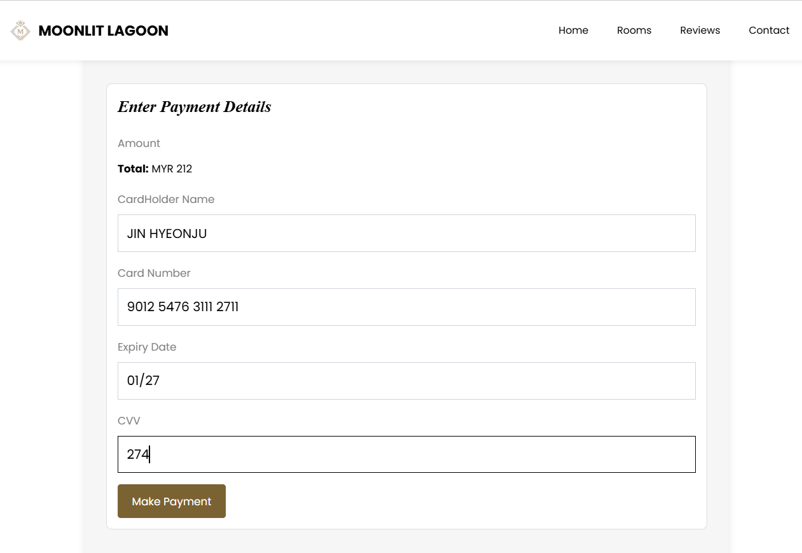
   Figure 12: User interface in payment page after enhancement.

   ### 3. Review
   ### a) Server-side Validation
   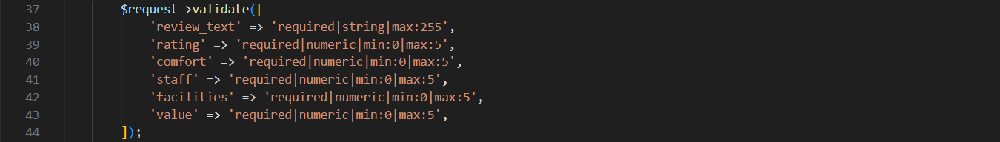
   Figure 13: Code in ReviewController.php before enhancement.

   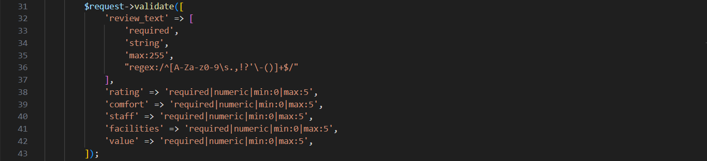
   Figure 14: Code in ReviewController.php after enhancement.
   
   #### i) Review Text (Whitelist)
   - The review text uses whitelist validation to allow only letters, numbers, spaces, and basic punctuation (e.g., . , ! ? ' - ( )). Any other special symbols are rejected.

   ### b) Client-side Validation
   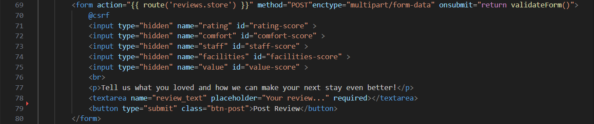
   Figure 15: Code in reviews.blade.php before enhancement.

   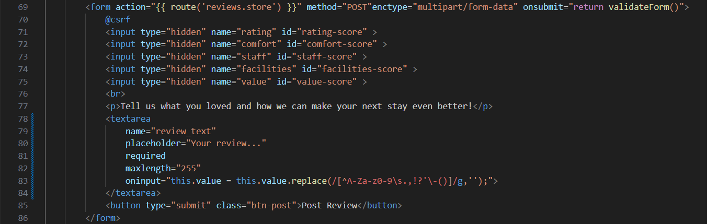
   Figure 16: Code in reviews.blade.php after enhancement.
   
   #### i) Review Text (Whitelist + Input Filtering)
   - Client-side filtering is applied on the review textarea using oninput to remove invalid characters immediately as the user types or pastes text.

   ### c) User Interface (UI)
   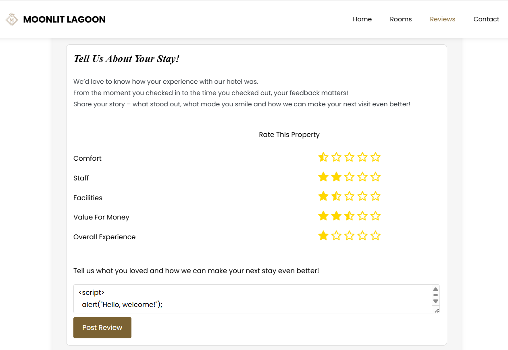
   Figure 17: User interface in reviews page before enhancement.

   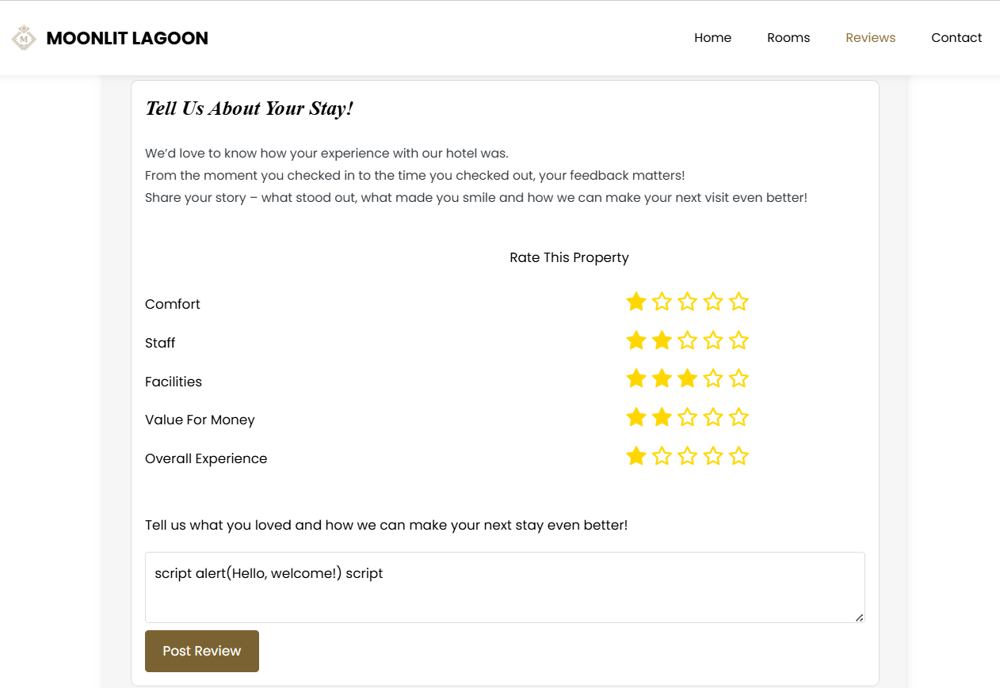
   Figure 18: User interface in reviews page after enhancement.

   
   ## Authentication Enhancements
   
   ### 1. Admin Authentication Enhanced
   
   #### Before Enhancement:
   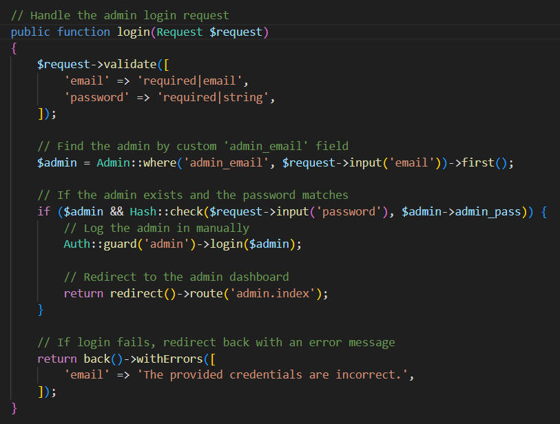

   Figure X: AdminLoginController.php before enhancement - basic authentication only.

   #### After Enhancement:
   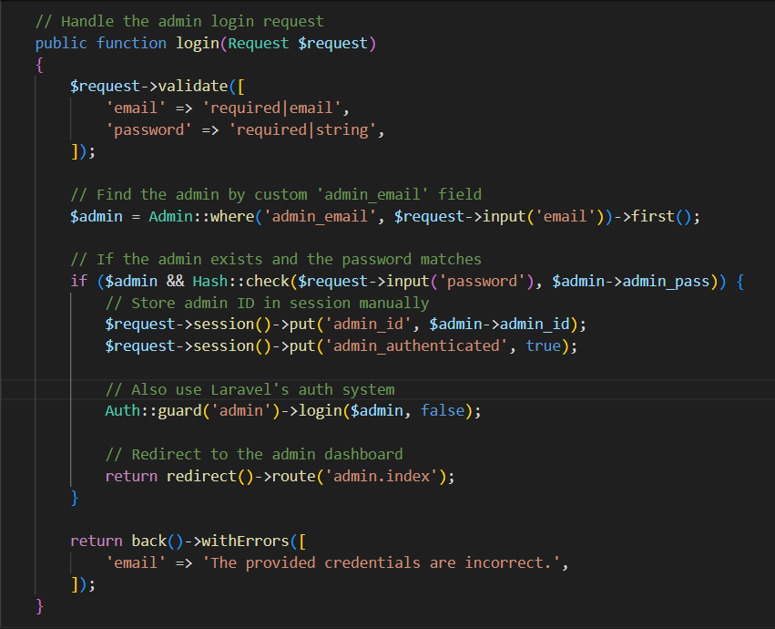

   Figure Y: AdminLoginController.php after enhancement - dual verification with guard and session.
   
   **Vulnerability Fixed:** Admin authentication was limited to Laravel's auth guard only. Enhanced with dual verification (both auth guard and manual session storage) to ensure reliable admin authentication and prevent session-related security issues.
   
   ---
   
   ### 2. Admin Route Protection (IsAdmin Middleware)
   
   #### Middleware Implementation:
   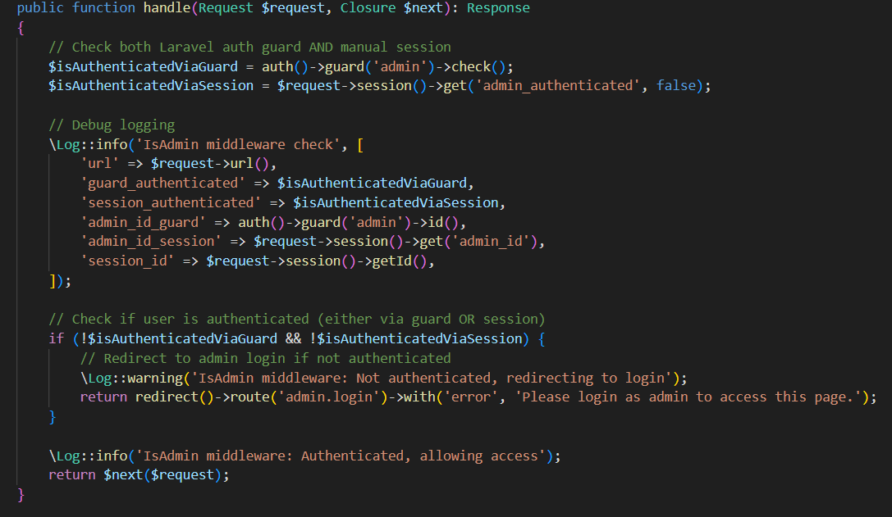

   Figure Z: IsAdmin middleware created to protect admin-only routes.
   
   **Vulnerability Fixed:** Admin dashboard (`/admin`) was accessible to anyone by directly typing the URL. Created IsAdmin middleware that verifies authentication via both guard and session, redirecting unauthorized users to login page.
   
   **Exploitation Example:** Before fix, any user could access `http://localhost:8000/admin` and view/modify all bookings without admin credentials.
   
   ---
   
   ### 3. Protected Route Structure
   
   #### Before Enhancement:
   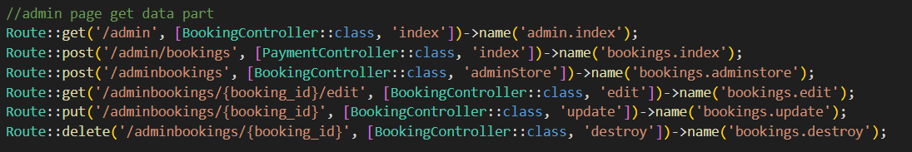

   Figure A: routes/web.php before enhancement - unprotected admin routes.

   #### After Enhancement:
   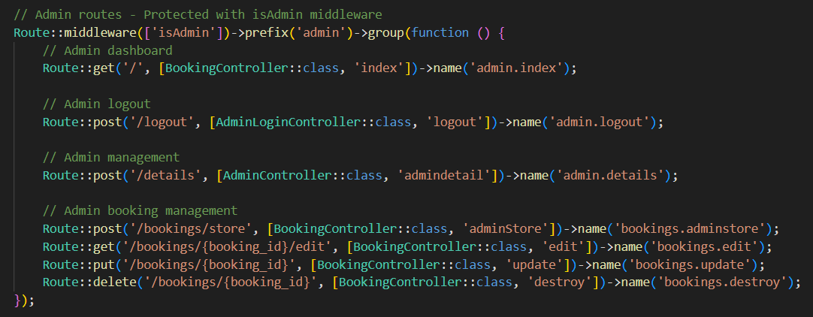

   Figure B: routes/web.php after enhancement - admin routes protected with IsAdmin middleware.
   
   **Vulnerability Fixed:** All admin routes were publicly accessible. Now grouped under `/admin` prefix with `isAdmin` middleware protection, ensuring only authenticated admins can access administrative functions.
   
   ---
   
   ### 4. Middleware Registration
   
   #### Before Enhancement:
   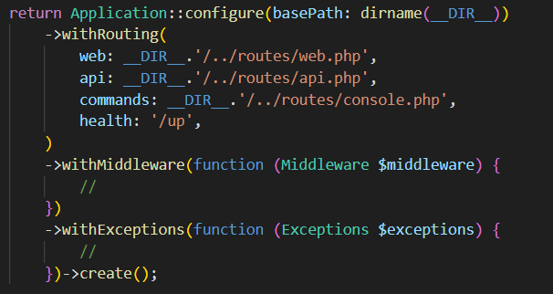

   Figure C: bootstrap/app.php before enhancement - no middleware registered.

   #### After Enhancement:
   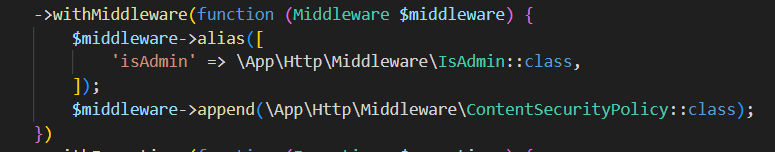

   Figure D: bootstrap/app.php after enhancement - IsAdmin middleware registered.
   
   **Implementation:** Registered IsAdmin middleware alias in bootstrap/app.php to enable route protection across the application.
   
   ---
   
   ## Authorization Enhancements
   
   ### 5. Booking Authorization - Create
   
   #### Before Enhancement:
   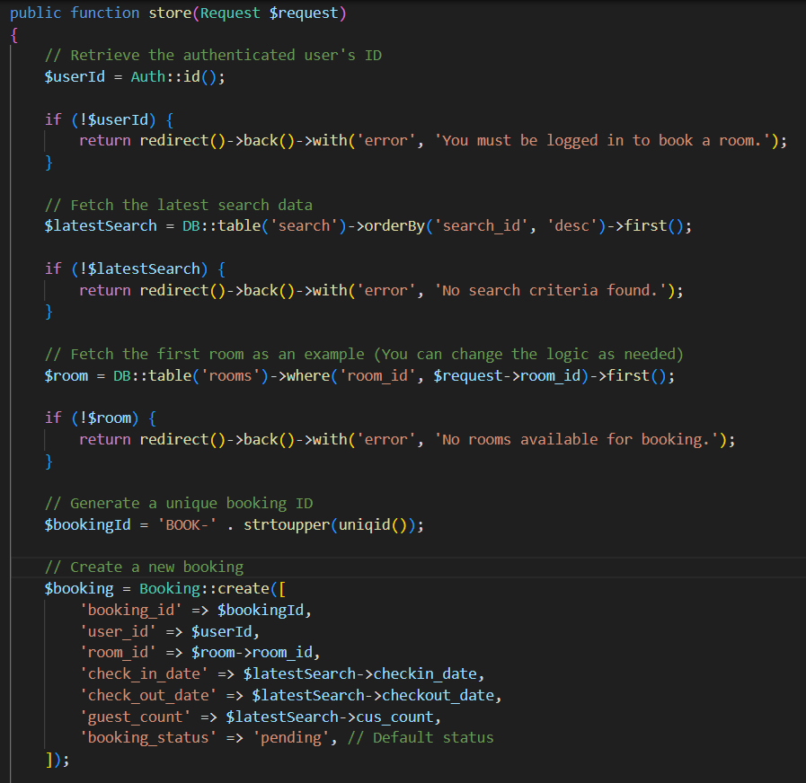

   Figure E: BookingController.php store method before enhancement - no authorization check.

   #### After Enhancement:
   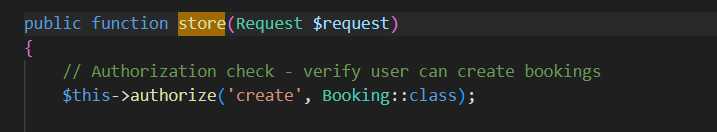

   Figure F: BookingController.php store method after enhancement - authorization check added.
   
   **Vulnerability Fixed:** No verification that authenticated users have permission to create bookings. Added `$this->authorize('create', Booking::class)` to enforce authorization policy before booking creation.
   
   ---
   
   ### 6. Booking Authorization - Delete
   
   #### Before Enhancement:
   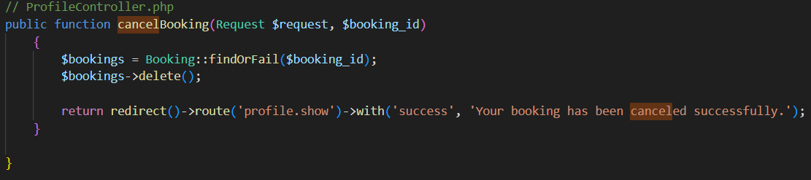

   Figure G: ProfileController.php cancelBooking method before enhancement - no ownership check.

   #### After Enhancement:
   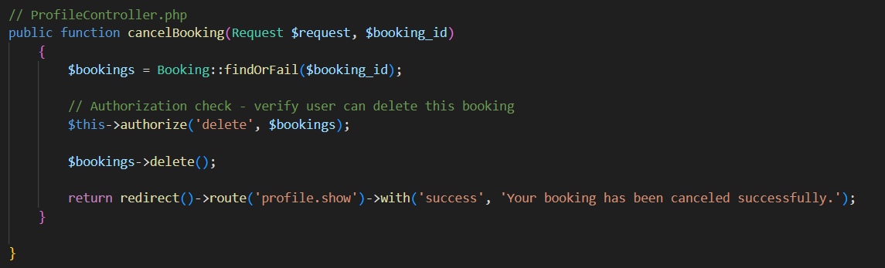

   Figure H: ProfileController.php cancelBooking method after enhancement - authorization check added.
   
   **Vulnerability Fixed:** Users could delete ANY booking by manipulating booking_id in the URL or browser console. Added `$this->authorize('delete', $bookings)` to verify ownership before deletion.
   
   **Exploitation Example:** Before fix, User A could cancel User B's booking by sending `DELETE /cancel-booking/5` even if booking 5 belongs to User B.
   
   ---
   
   ### 7. BookingPolicy Rules

   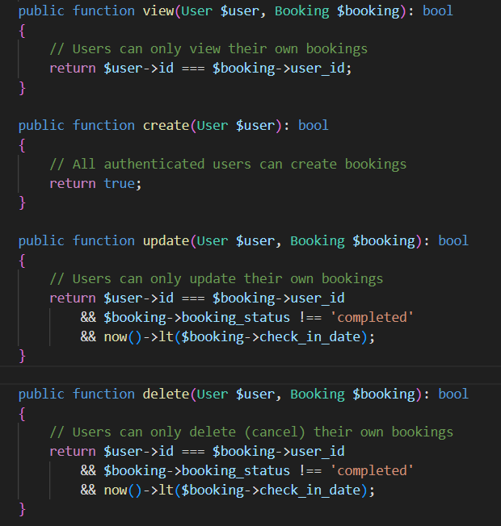

   Figure I: BookingPolicy.php - authorization rules for bookings.
   
   **Policy Rules Implemented:**
   - Users can only view/update/delete their own bookings (`user_id` ownership check)
   - Bookings cannot be modified after check-in date or if status is 'completed'
   - Time-based restrictions prevent unauthorized modifications
   
   ---
   
   ### 8. Review Authorization - Create
   
   #### Before Enhancement:
   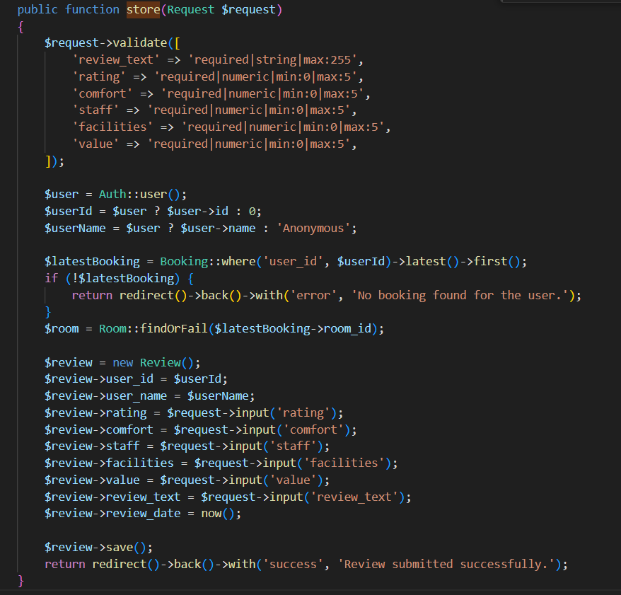

   Figure J: ReviewController.php store method before enhancement - no authorization check.

   #### After Enhancement:
   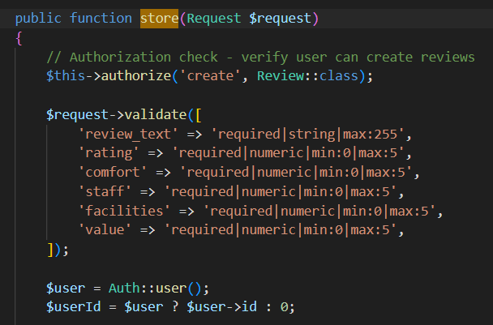

   Figure K: ReviewController.php store method after enhancement - authorization check added.
   
   **Vulnerability Fixed:** Added `$this->authorize('create', Review::class)` to enforce authorization before review creation.
   
   ---
   
   ### 9. Review Authorization - Update
   
   #### Before Enhancement:
   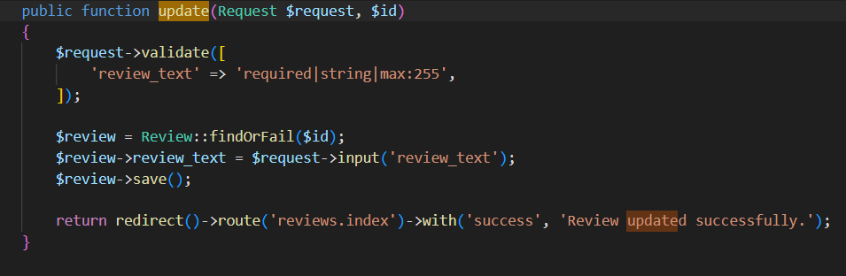

   Figure L: ReviewController.php update method before enhancement - no ownership check.

   #### After Enhancement:
   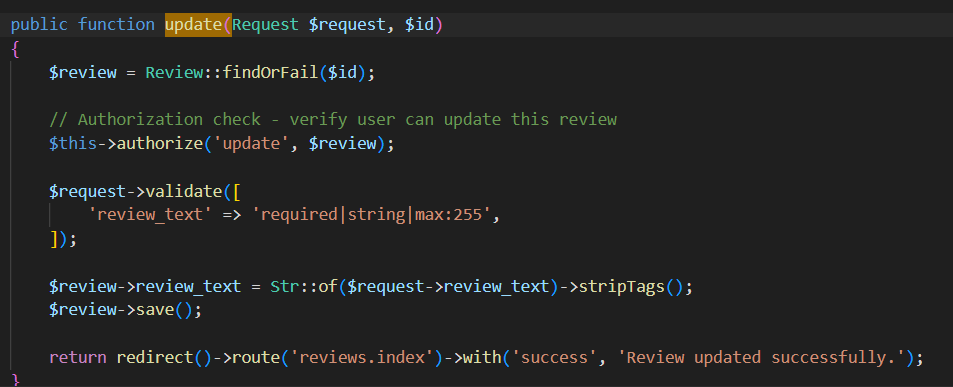

   Figure M: ReviewController.php update method after enhancement - authorization check added.
   
   **Vulnerability Fixed:** Users could edit ANY review by changing the review ID in URL. Added `$this->authorize('update', $review)` to verify ownership and enforce 30-day edit limit.
   
   **Exploitation Example:** Before fix, User A could edit User B's negative review by accessing `PUT /reviews/10` even if review 10 belongs to User B.
   
   ---
   
   ### 10. Review Authorization - Delete
   
   #### Before Enhancement:
   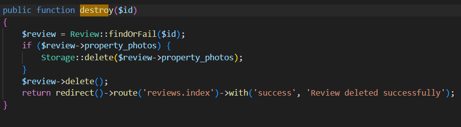

   Figure N: ReviewController.php destroy method before enhancement - no ownership check.

   #### After Enhancement:
   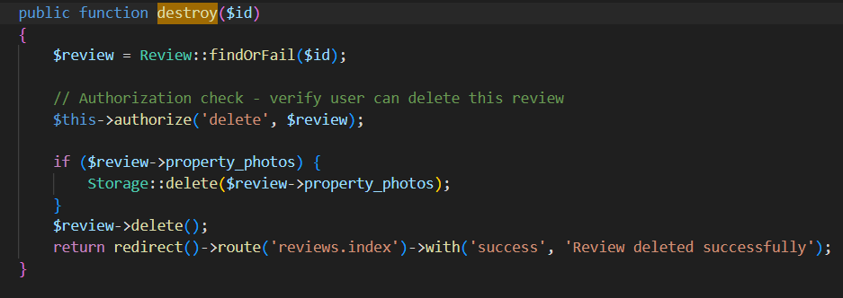

   Figure O: ReviewController.php destroy method after enhancement - authorization check added.
   
   **Vulnerability Fixed:** Users could delete ANY review. Added `$this->authorize('delete', $review)` to verify ownership before deletion.
   
   ---
   
   ### 11. ReviewPolicy Rules

   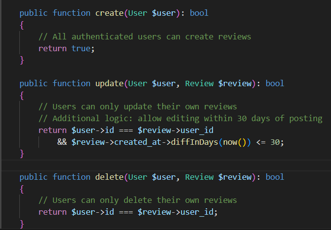

   Figure P: ReviewPolicy.php - authorization rules for reviews.
   
   **Policy Rules Implemented:**
   - Users can only update their own reviews within 30 days of posting (`user_id` ownership + time restriction)
   - Users can only delete their own reviews (`user_id` ownership check)
   - Public can view all reviews (no authentication required for viewing)
   
   ---
   
   ## Summary
   
   ### Files Created:
   1. `app/Http/Middleware/IsAdmin.php` - Admin route protection
   2. `app/Policies/BookingPolicy.php` - Booking authorization rules
   3. `app/Policies/ReviewPolicy.php` - Review authorization rules
   
   ### Files Modified:
   1. `app/Http/Controllers/AdminLoginController.php` - Enhanced authentication
   2. `app/Http/Controllers/BookingController.php` - Added authorization checks
   3. `app/Http/Controllers/ReviewController.php` - Added authorization checks
   4. `app/Http/Controllers/ProfileController.php` - Added authorization checks
   5. `app/Models/Admin.php` - Fixed authentication identifier for session storage
   6. `bootstrap/app.php` - Registered IsAdmin middleware
   7. `routes/web.php` - Protected admin routes with middleware
   
   ### Security Impact:
   - Prevented unauthorized access to admin dashboard
   - Prevented users from modifying other users' bookings/reviews (IDOR attack prevention)
   - Added time-based restrictions (30-day edit limit, no post-check-in modifications)
   - Implemented dual authentication for admin access
   - Enforced ownership verification before all CRUD operations

   ## XSS and CSRF Enhancements
   ### 1. Content Security Policy (CSP)
   
   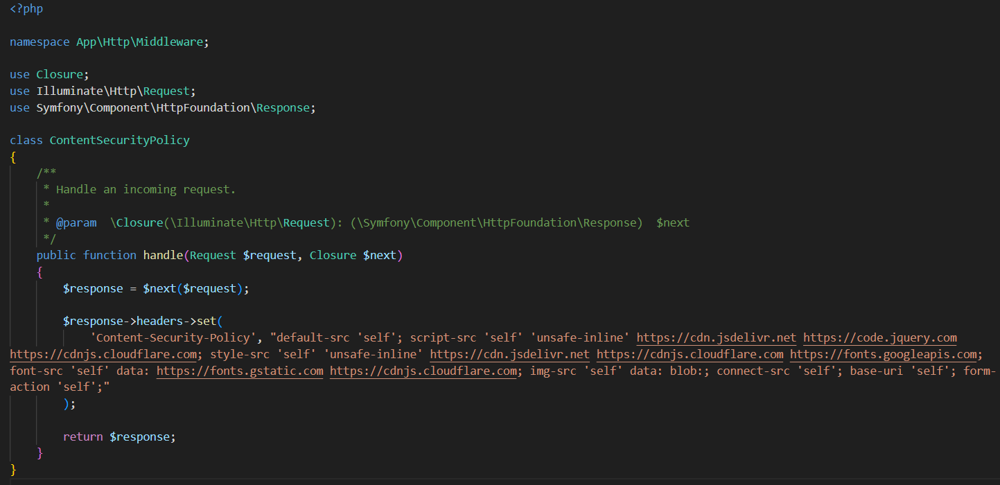
   
   Figure X: ContentSecurityPolicy middleware created to significantly reduces the risk of XSS attacks.

   **Fix Achieved:** While Laravel has a built-in CSRF token mechanism, Content Security Policy (CSP) adds an additional layer of protection against XSS attacks. ContentSecurityPolicy middleware applies a CSP header to every HTTP response generated by the application. CSP is a browser-enforced security mechanism that restricts which sources of content are allowed to be loaded and executed on a webpage.

   ### 2. Booking Controller Enhancement

   ### a) Centralized Input Validation

   #### Before Enhancement:
   
   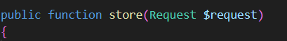

   Figure X: Raw "Request" object was used, alongsided minimal validation logic. Risk of unvalidated user input reaching the database or views and exposure to stored XSS attacks.

   #### After Enhancement:

   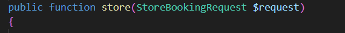

   Figure X: Validation moved to a Form Request class. All booking inputs are validated before reaching controller logic.

   **Fix Achieved:** Prevents malicious payloads from being stored or reflected in views. Malicious scripts (e.g. ) are blocked at validation level before being stored or displayed.

   ### b) Safe Data Handling

   #### Before Enhancement:

   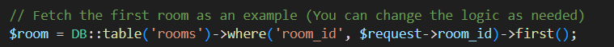

   Figure X: Raw query usage increases risk when combined with poor validation which makes it harder to enforce consistent security rules.

   #### After Enhancement:

   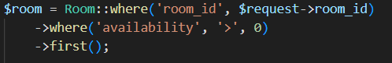

   Figure X: ORM enforces parameter binding which prevents Prevents injection of malicious input and while also reduces chances of tainted data being rendered later.

   **Fix Achieved:** Reduces injection vectors that could lead to stored XSS.

   ### C) Controlled Update Logic

   #### Before Enhancement:

   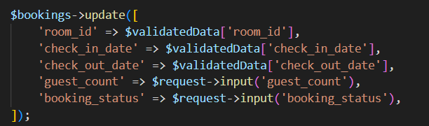

   Figure X: No checks on sensitive state changes. CSRF attack could silently modify booking relationships.

   #### After Enhancement:

   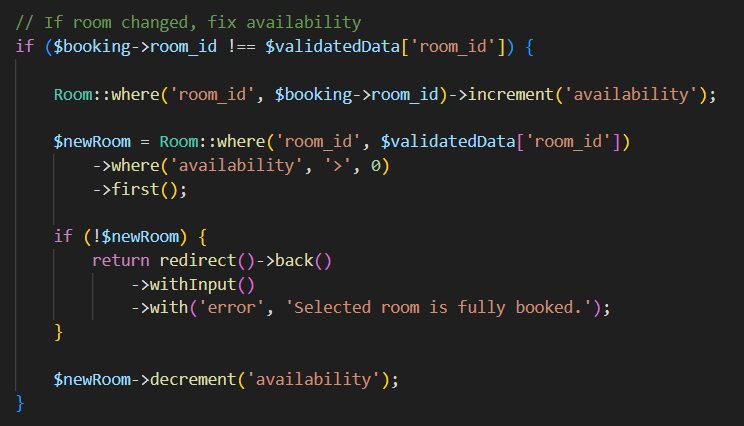

   Figure X: Limits the effect of forged requests and ensures state changes follow valid business logic. This helps prevent silent data manipulation through CSRF

   **Fix Achieved:** CSRF impact is minimized even if request passes token check.

   ## Database Security Principles

   - ***Secure Error Handling***
     
      **What does this principle to the web app:**

     Prevents SQL errors (table names, query fragments, column names) from leaking to the user, which attackers can use to craft more precise attacks

     **Files Modified/Created:**

     bootstrap/app.php was modified

     Before modified,

     
  
     After modified,

     

     

     New file resources/views/errors/500.blade.php also was created to support the modified file

     

   - ***Input Validation (Whitelisting)***

      **What does this principle to the web app:**

     Previous web application state accepts many user-controlled inputs that affect database records, such as room_id, checkin_date, checkout_date, guest_count, card_number. If these are not strictly validated, attackers can send malformed or malicious payload. This principle only allow expected formats/values and not try to filter bad things.

     **Files Modified/Created:**

     app/Http/Controllers/BookingController.php

     Before modified,

     

     After nodified,

     

     

     New file app/Http/Requests/BookingRequest.php also was created to support the modified file

     

     app/Http/Controllers/RoomController.php

     Before modified,

     

     After modified,

     

     app/Http/Controllers/PaymentController.php

     Before modified,

     

     After modified,

     

     

     New file app/Http/Requests/StorePaymentRequest.php also was created to support the modified file

     

   - ***Stored Procedures***

      **What does this principle to the web app:**

     This principle is used to prevent race conditions in this web application (e.g. two users booking the last room) and inconsitent data

     **Files Modified/Created:**

     app/Http/Controllers/BookingController.php

     Before modified,

     

     After modified,

     

     New file database\migrations\2025_12_16_093152_create_stored_procedures.php also was created to support the modified file

     

     

  - ***Encrypted Database Connections (TLS/SSL)***

      **What does this principle to the web app:**

     This principle ensures that data transmitted between the web application server and the databse server is encrypted. Sensetive information (credentials, user data, bookings, payments) cannot be intecepted (man-in-the-middle attack) and read in plain text on the network. This is achieved by enabling TLS/SSL encryption for database connections.

     **Files Modified/Created:**

     .env.example

     Before modified,

     

     After modified,

     

     config/database.php

     Before modified,

     

     After modifed,

     

     Note of usage: Encrypted database connections are configured at the application level and enabled in production environments where the database is accessed over a network. For local development using XAMPP, SSL is not enforced as the database runs on the same host. TLS certificates (ca.pem) are provided by hosting provider (production) and cloud DB services.

   - ***Restrict User-Controlled SQL Components***
  
      **What does this principle to the web app:**

     This principle prevents SQL Injection and logic abuse by ensuring that users cannot control SQL structure such as column names, sort directions, table names. Only predefined, whitelisted values are allowed.

     **Files Modified/Created:**

     app/Http/Controllers/RoomController.php

     Before modified,

     
  
     After modified,

     

   - ***Least Privilege***
    
       **What does this principle to the web app:**

       This principle limits database access by ensuring the web application uses a non-root database account with only necessary permissions. It reduces the risk and impact of attacks by preventing unauthorized schema changes, user management, and database-wide modifications, even if the application is compromised.

       **Files Modified/Created:**

       .env.example

       Before modified,

       

       After modified,

       

## References
1. Bukit Bintang Accommodation | JW Marriott Hotel Kuala Lumpur. (n.d.). Marriott Bonvoy. https://www.marriott.com/en-us/hotels/kuldt-jw-marriott-hotel-kuala-lumpur/rooms/
2. The Regency Hotel – Kuala Lumpur. (n.d.). https://theregencyhotel.my/kualalumpur/
3. Wondershare Edraw. (2021, December 9). UML Sequence Diagram Tutorial | Easy to Understand with Examples [Video]. YouTube. https://www.youtube.com/watch?v=gzKe7yt8qEo
